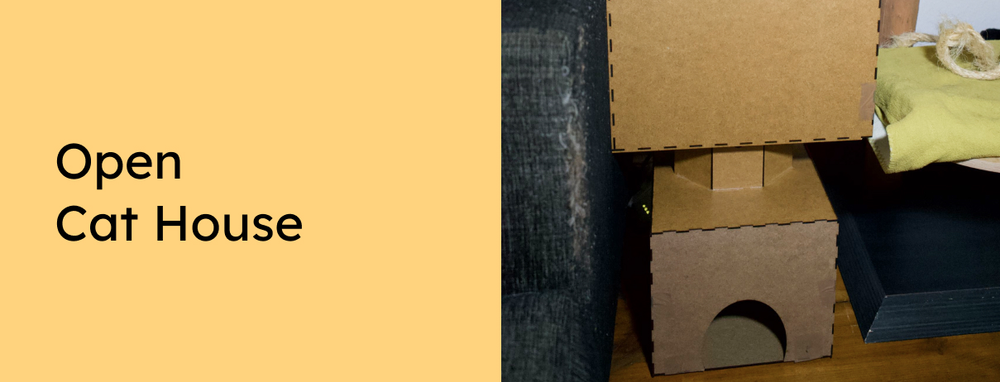

The open-source cat house which you can easily build yourself with a laser cutter and 3mm thick MDF plates.

Want to support the development and stay updated?

 

## Instrutions

If you want to have a single cat house, lasercut the files from the "Single House" folder. Or if you need a tower with multiple cat houses - take the files from the "House Tower" folder.

Next, take a look at the 3D model to see how the separate parts are connected (in case it isn't clear). Link to 3D model: [https://www.tinkercad.com/things/94Es1OfjEqL](https://www.tinkercad.com/things/94Es1OfjEqL 
)
